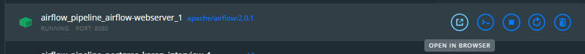
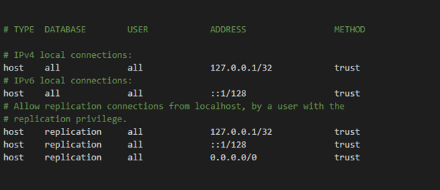
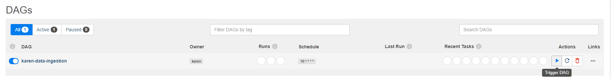
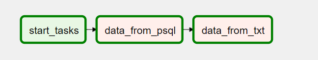

# Server info
The project is designed to be deployed using Docker and Airflow. The user interface can be accessed by:

http://localhost:8080/home

Please find instructions for setting up below:


# Docker Setup

- Follow instructions from [here](http://airflow.apache.org/docs/apache-airflow/stable/start/docker.html) to download Docker Desktop

- clone this repo, and then **cd into the directory where this repo is located**
- Run commands below

##### Init

```
mkdir -p .\dags .\logs .\plugins
echo -e "AIRFLOW_UID=$(id -u)\nAIRFLOW_GID=0" > .env
```

get images

```
docker-compose up airflow-init
```

compose up

```
docker-compose up --build -d
```
Go to the Docker Desktop UI and launch ]

# Airflow Setup

- Login information: 

    -username:airflow

    -password: airflow

# Postgres Setup

- Load processdb to Postgres database using PGAdmin/ command line, by running processdb.sql located in [airflow_pipeline](https://github.com/Karenzhang7717/airflow_pipeline/tree/karen_dev)/[dae-challenge](https://github.com/Karenzhang7717/airflow_pipeline/tree/karen_dev/dae-challenge)/**x-materials-database**/. Notice that the owner has been changed from "de_candidate" to "karen" in sql script. Set up host = localhost, port = 5433

- Direct to the location that PostgreSQL is installed, find pg_hba file (C:\Program Files\PostgreSQL\12\data\pg_hba ) in my case, and change METHOD to trust for all connections like below:

  

- Grant access for user karen:

  cd into the location to PostgresSQL's bin, run the command below:

  C:\Program Files\PostgreSQL\12\bin>**psql.exe -U [*superuser*]**

  Now you are logged in as the superuser, you should see "GRANT" on console. Run command below:

  GRANT ALL PRIVILEGES ON ALL TABLES IN SCHEMA public TO karen;

  # Trigger DAG and view result

- Trigger the dag:

  

- The graph view should look like this:

  

- Go to the location that the repo is stored, the generated master_db.csv is located in the logs folder (e.g. D:\Karen\airflow_pipeline\logs)